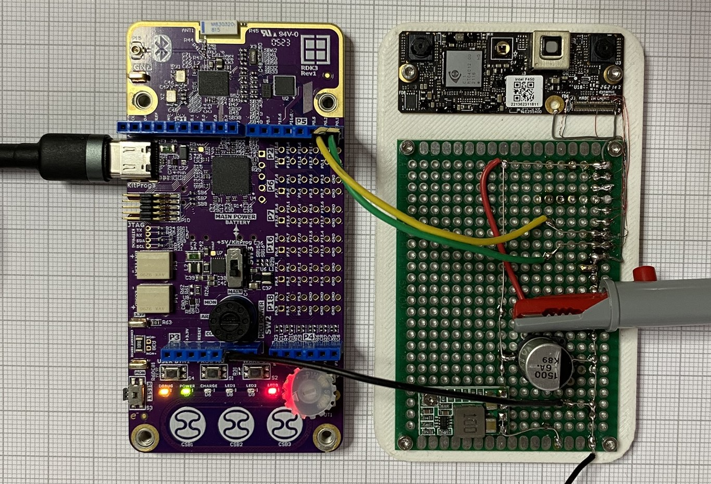
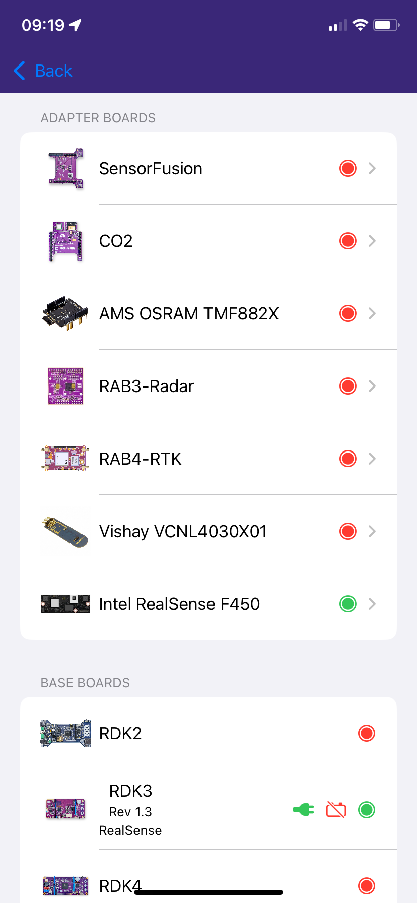
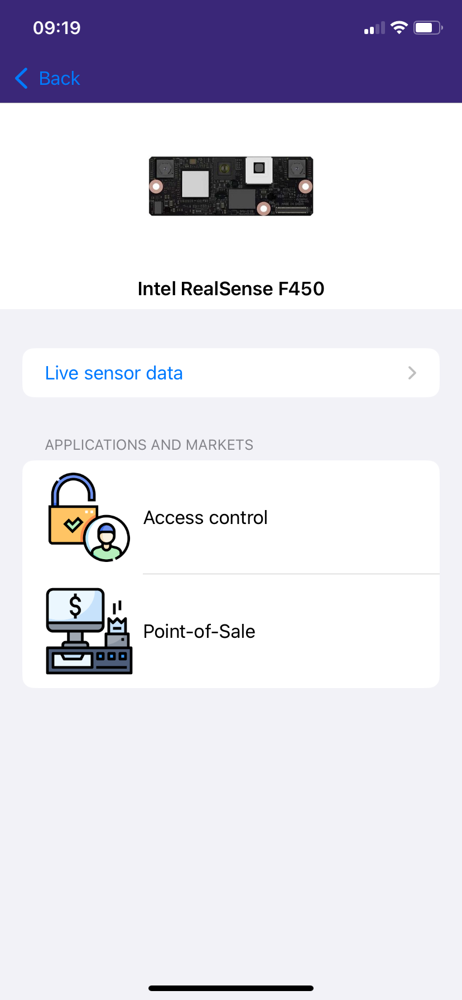
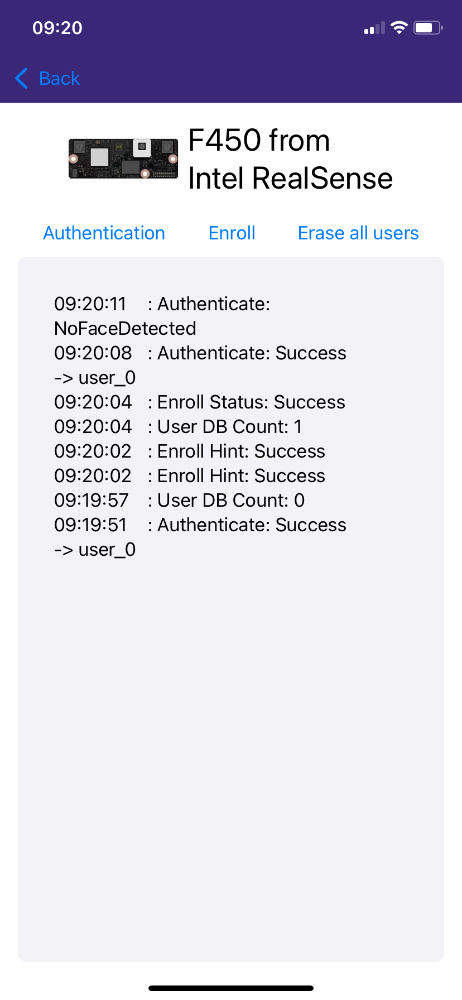
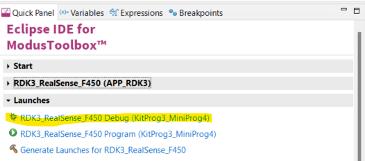

# RDK3 - Face authentication using RealSense F450 module

Rutronik Development Kit 3 Programmable System-on-Chip CYB06447BZI-BLD53 "Face Authentication" Code Example.

This code example demonstrates face authentication using RealSense F450 module.



## Requirements

- [ModusToolbox® software](https://www.infineon.com/cms/en/design-support/tools/sdk/modustoolbox-software/) **v3.x** [built with **v3.3**]
- RealSense F450 adapter module (ask your Rutronik contact)

- [ModusToolbox® software](https://www.infineon.com/cms/en/design-support/tools/sdk/modustoolbox-software/) **v3.2**: 

1. The [Python](https://www.python.org/) has to be installed manually on Windows OS.
2. Make sure the Python installation is added to the path variable. 
3. Use this command to install the [cysecuretools](https://pypi.org/project/cysecuretools/) package:

```
pip install cysecuretools
```

## Supported toolchains (make variable 'TOOLCHAIN')

- GNU Arm&reg; Embedded Compiler v11.3.1 (`GCC_ARM`) - Default value of `TOOLCHAIN`

## The Provisioning of the RDK3

The CYB06447BZI-BLD53 device must be provisioned with keys and policies before being programmed. Refer to the RDK3 documentation to see how to do this.

**Important**
Because of the size of the RealSense ID SDK, the RDK3 should be provisioned using the policy_single_CM0_CM4_smif.json. This type of provisioning has been chosen because it extends internal flash capacity to 0xD0000 kb. The second image on SMIF external memory is never used in this demo.

### Operation

Apply 3.3V on the power supply of the RealSense F450 and then plug a USB cable on the RDK3.

Open the iOS app and navigate to the "F450 from Intel RealSense" menu.

You then have 3 options:
- Authenticate: The module checks if a face is in front, and then check if the user is in the database
- Enroll: Enables to add a user in the database
- Erase all users: Flush the user database





### Debugging

If you successfully have imported the example, the debug configurations are already prepared to use with a the KitProg3, MiniProg4, or J-link. Open the ModusToolbox™ perspective and find the Quick Panel. Click on the desired debug launch configuration and wait for the programming to complete and the debugging process to start.



## Enable exceptions

Important: to build the project, you will need to modify the file mtb_shared/recipe-make-cat1a/release-vX.X.X/make/toolchains/GCC_ARM.mk

By default, the option fno-exceptions is set, and you need to remove it (MTB_TOOLCHAIN_GCC_ARM__CXXFLAGS).

## Legal Disclaimer

The evaluation board including the software is for testing purposes only and, because it has limited functions and limited resilience, is not suitable for permanent use under real conditions. If the evaluation board is nevertheless used under real conditions, this is done at one’s responsibility; any liability of Rutronik is insofar excluded. 


